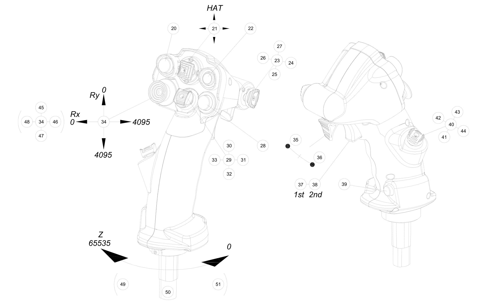
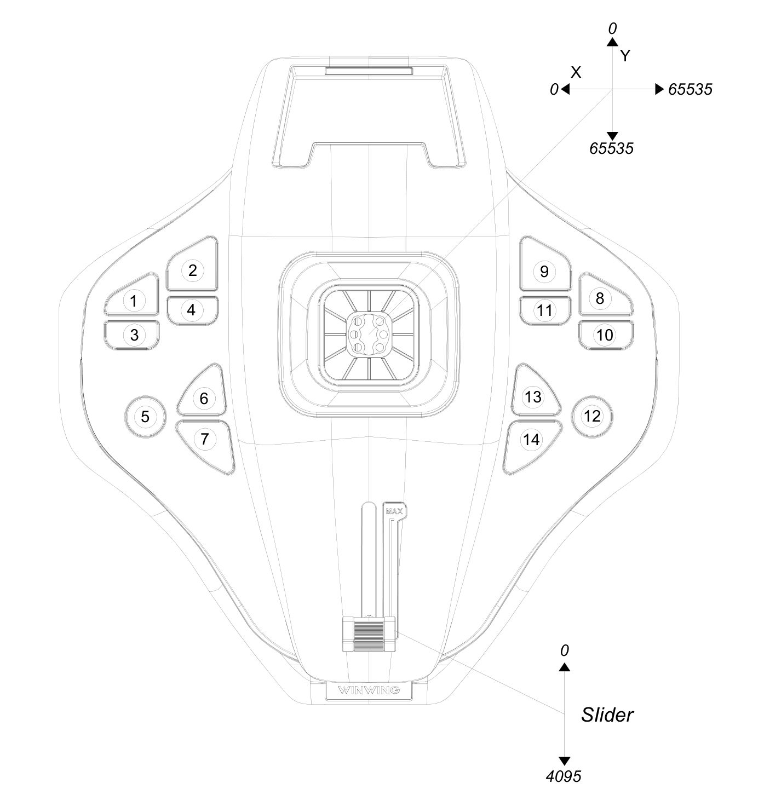

# Ace Combat™ 7: Skies Unknown configuration file for Winwing Ursa Minor Fighter joystick

I made a configuration for the Ursa Minor but since the game doesn't support controller more than 32 buttons (Ursa minor has 44), I had to complete this configuration with a small [JoyToKey](https://joytokey.net) mapping for 3 buttons.

## Layout

| **Function**        | **Mapping**             | **Key mapping** |
| ------------------- | ----------------------- | --------------- |
| Roll / Pitch / Yawn | Joystick X / Y / Z axes |                 |
| Throttle            | Joystick slider         |                 |
| Change view         | Left Hat (Ry / Rx axes) |                 |
| Fire machine gun    | Button 37               | Left-Ctrl       |
| Fire missile/weapon | Button 35               | Space           |
| Target              | Button 20               |                 |
| Speed               | Button 22               |                 |
| Change weapon       | Button 39               | C               |
| Switch radar map    | Button 7                |                 |
| Fire Flare          | Button 28               |                 |
| Change view         | Button 5                |                 |
| Autopilot           | Button 6                |                 |
| Pause               | Button 2                |                 |

## Install AC7 configuration

Copy the `ac7/Input.ini` file as `C:\Users\<username>\AppData\Local\BANDAI NAMCO Entertainment\ACE COMBAT 7\Config\Input.ini`.

## Install JoyToKey configuration

Copy the `joytokey\ac7+ursa-minor.cfg` file in the Joy2key configuration folder. You can access it with the `File > Open config data folder in Explorer` function in JoyToKey.
